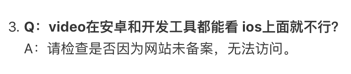

# 微信小程序IOS不能播放视频，Android和开发工具上可以播放

### 问题描述
微信小程序使用video标签播放后台上传的视频，在真机上调试的时候，发现iPhone上点击开始按钮，显示loading状态后仍然是黑屏，而Android和开发工具上可以正常播放。

### 查找问题
开发阶段：在小程序论坛上查找类似问题，官方有解释说：

以为是因为视频地址是公司内部IP，未备案所以不能播放，就暂时放下了。

上线前：使用阿里云环境的地址，IOS小程序依然无法播放，论坛上类似的回答说先确认在safari上也能播放，在Safari上测试确实无法播放，所以问题的查找方向就变成"Safari无法播放h5视频"
参考了这2篇博客后，大致知道了原因：

[java处理苹果浏览器safari无法播放视频流（Accept-Ranges）](https://blog.csdn.net/u010120886/article/details/79007001)
[h5点播播放mp4视频遇到的坑,ios的h5不能播放视频等](https://blog.csdn.net/zhengbin6072/article/details/78235004)
主要是后端返回视频流的问题，对于Safari来说，不是一次性请求完整个文件，一般首先会请求0-1字节获取文件总长度，然后分段请求视频数据。

### 解决方法
最后还是交给后端去优化返回视频流的接口，这里只是给遇到相同问题的人提供一个思路。

### 结果
改成分段返回视频数据后，safari和IOS的小程序均能正常播放了。